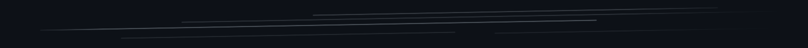

  <a href="README.md">🇺🇸 English</a> | 
  <a href="README.ja.md">🇯🇵 日本語</a> | 
  <a href="README.zh.md">🇨🇳 中文</a> | 
  <a href="README.es.md">🇪🇸 Español</a> | 
  <a href="README.de.md">🇩🇪 Deutsch</a>

  

##  Hola, soy Rabbit 🐱‍💻 | Desarrollador 🇯🇵 desde 2016
*Next.js/TypeScript | Nginx/Ubuntu | Grafana/Prometheus* 
 

¡Hola! Soy un <strong>desarrollador</strong> de Tokio, Japón.

- Mediados de los 20 | Me gustan los pingüinos, zorros y conejos  
- Apasionado por las contribuciones de código abierto y la implementación social de soluciones tecnológicas  
- Enfocado en el desarrollo impulsado por IA y tecnologías de vanguardia para impulsar la innovación  
- Enfoque Actual: Estudiando Bioinformática en escuela de posgrado  

<strong>¿Buscando una relación?</strong> *2

- Él/Él, No es una minoría | Soltero a partir de febrero de 2025  
- Buscando una <strong>pareja asiática*1</strong>
- Alguien que le guste/respete nuestra cultura e idioma (como yo lo hago)  
- Preferiblemente en el campo del marketing web o en línea  

*1: Limitado a individuos de Indonesia, India, Japón, Malasia, Tailandia o Vietnam, ya que aprecio estos países y estoy abierto a aprender más sobre sus culturas y personas.  
*2: La disponibilidad puede variar con el tiempo; verifique la disponibilidad en consecuencia.

  

<strong>¿Buscando ayuda de Austria?</strong>

- Actualmente explorando oportunidades para trasladarme a Austria (Österreich)
- Interesado en trabajo remoto o posiciones presenciales en el campo tecnológico/desarrollo
- Aprendiendo alemán para integrarme mejor en la cultura austriaca y el lugar de trabajo
- Abierto a colaborar con empresas austriacas o startups
- Fascinado por el ecosistema de innovación de Austria y la calidad de vida

Estás viendo una versión antigua (febrero de 2025) de mi perfil. Para la versión de 2027, consulta:

